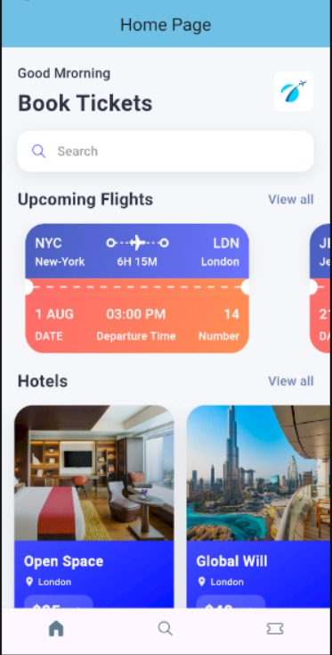
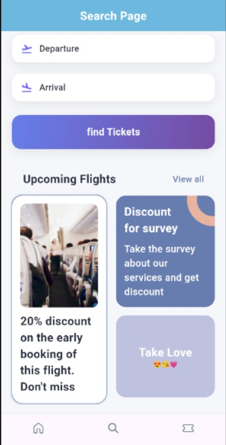
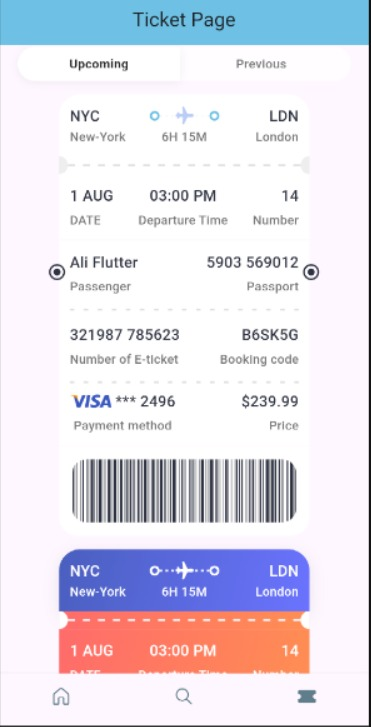
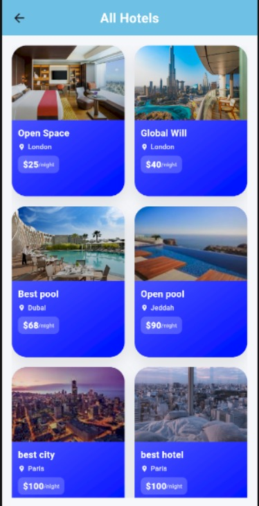

<div align="center">

# 🎟️ TICKET_APP

### Book Flights & Hotels Seamlessly


<br>

**Built with the tools and technologies:**


</div>

---

A modern, sleek ticket booking mobile application built with Flutter. Book flights, manage trips, and reserve hotels — all in one beautiful, responsive interface.

## Table of Contents

- [Overview](#overview)
- [Why Ticket App?](#why-ticket-app)
- [Features](#features)
- [Architecture](#architecture)
- [Getting Started](#getting-started)
  - [Prerequisites](#prerequisites)
  - [Installation](#installation)
- [Usage](#usage)
- [Project Structure](#project-structure)
- [Screenshots](#screenshots)
- [Tech Stack](#tech-stack)
- [Contributing](#contributing)
- [License](#license)

## Overview

Ticket App is a **UI/UX demonstration project** showcasing modern mobile app design principles using Flutter. This is a **frontend-only application** with static data, designed to demonstrate beautiful user interfaces, smooth animations, and responsive layouts for a travel booking concept.

> **Note**: This app does not include backend integration, real booking functionality, or payment processing. It serves as a UI template and design reference for ticket booking applications.

## Why Ticket App?

- **Modern Design Showcase**: Demonstrates contemporary UI patterns with gradients, shadows, and animations
- **Responsive Layout**: Optimized for all screen sizes, from small phones (Huawei P30 Lite) to tablets
- **Clean Code Structure**: Well-organized, modular codebase perfect for learning Flutter
- **Reusable Components**: Custom widgets that can be adapted for real projects
- **UI/UX Best Practices**: Follows modern mobile design guidelines

## Features

> **Note**: All features are UI demonstrations with static/mock data. No actual booking or payment processing is implemented.

### ✈️ Flight Booking UI
- Browse flight cards with gradient backgrounds
- View flight details with departure and arrival information
- Upcoming flights section with horizontal scroll
- Digital ticket UI with barcode display

### 🏨 Hotel Reservations UI
- Beautiful hotel cards with image overlays
- Location icons and pricing badges
- Grid and list view layouts
- Filter interface for hotels

### 🔍 Search Interface
- Modern search page with tab navigation
- Departure and arrival input fields
- Gradient "Find Tickets" button
- Promotional cards section

### 🎫 Ticket Details Display
- Detailed ticket information layout
- Passenger and passport details UI
- E-ticket number and booking code display
- Payment method visualization
- Scannable barcode widget

### 🎨 Modern UI/UX Components
- **Gradients**: 5 custom gradient definitions for different sections
- **Shadows**: Elevated card shadows for depth
- **Typography**: Hierarchical text styles (4 levels)
- **Animations**: Smooth transitions between screens
- **Responsive**: Adapts to different screen sizes
- **Consistent Design**: Unified color scheme and styling

## Architecture

This is a **UI-focused Flutter application** with a clean, modular structure. The app uses static data defined in JSON format for demonstration purposes.

```
lib/
├── base/
│   ├── res/
│   │   ├── media/        # App icons and image paths
│   │   └── styles/       # Centralized styling (gradients, colors, shadows)
│   ├── utils/            # Static data (all_json.dart)
│   └── widgets/          # Reusable UI components
├── screens/
│   ├── home/             # Home screen with flights and hotels
│   ├── search/           # Search interface
│   └── ticket/           # Ticket details display
└── main.dart             # App entry point with routing
```

### Key UI Components

- **AppStyles**: Centralized styling with 5 gradients, shadows, and 4 text style levels
- **TicketView**: Reusable ticket card with gradient sections
- **Hotel**: Hotel card component with image overlay
- **Static Data**: Mock flight and hotel data in `all_json.dart`
- **Navigation**: Simple route-based navigation
- **Responsive**: Compact layouts for smaller devices (tested on Huawei P30 Lite)


## Getting Started

### Prerequisites

Before you begin, ensure you have the following installed:

- [Flutter SDK](https://docs.flutter.dev/get-started/install) (3.0.0 or higher)
- [Dart SDK](https://dart.dev/get-dart) (3.0.0 or higher)
- Android Studio / VS Code with Flutter extensions
- An emulator or physical device for testing

### Installation

1. **Clone the repository**
   ```bash
   git clone https://github.com/OsmanMj/ticket_app.git
   cd ticket_app
   ```

2. **Install dependencies**
   ```bash
   flutter pub get
   ```

3. **Run the app**
   ```bash
   flutter run
   ```

   Or select your device in your IDE and click Run.

## Usage

This app is designed for **UI/UX demonstration and learning purposes**. You can:

- **Explore the UI**: Navigate through different screens to see modern design patterns
- **Study the Code**: Learn how to implement gradients, shadows, and responsive layouts
- **Customize**: Modify colors, gradients, and styles in `app_styles.dart`
- **Extend**: Add backend integration for real booking functionality
- **Reuse Components**: Extract widgets for your own projects

### Running on Different Platforms

**Android/iOS:**
```bash
flutter run
```

**Windows:**
```bash
flutter run -d windows
```

**Web:**
```bash
flutter run -d chrome
```

### Building for Production

**Android APK:**
```bash
flutter build apk --release
```

**iOS:**
```bash
flutter build ios --release
```

**Windows:**
```bash
flutter build windows --release
```

## Project Structure

```
ticket_app/
├── assets/
│   └── images/          # Hotel and app images
├── lib/
│   ├── base/
│   │   ├── res/
│   │   │   ├── media/
│   │   │   │   └── app_media.dart
│   │   │   └── styles/
│   │   │       └── app_styles.dart
│   │   ├── utils/
│   │   │   └── all_json.dart
│   │   └── widgets/
│   │       ├── app_double_text.dart
│   │       ├── app_layoutbuilder_widget.dart
│   │       ├── text_style_fourth.dart
│   │       ├── text_style_third.dart
│   │       └── ticket_view.dart
│   ├── screens/
│   │   ├── home/
│   │   │   ├── all_hotels.dart
│   │   │   ├── all_tickets.dart
│   │   │   ├── home_screen.dart
│   │   │   └── widgets/
│   │   │       └── hotel.dart
│   │   ├── search/
│   │   │   ├── search_screen.dart
│   │   │   └── widgets/
│   │   │       ├── app_text_icon.dart
│   │   │       ├── app_ticket_tabs.dart
│   │   │       ├── find_tickets.dart
│   │   │       └── ticket_promotion.dart
│   │   └── ticket/
│   │       └── ticket_Screen.dart
│   └── main.dart
├── pubspec.yaml
└── README.md
```

## Screenshots

| Home Screen | Search Page |
|:---:|:---:|
|  |  |
| Modern gradient search bar & upcoming flights | Tab navigation & gradient search button |

| Ticket Details | All Hotels |
|:---:|:---:|
|  |  |
| Complete ticket info with barcode | Grid layout with gradient hotel cards |

## Tech Stack

- **Framework**: Flutter 3.x
- **Language**: Dart 3.x
- **UI Components**: Material Design widgets
- **Icons**: Fluent UI Icons (fluentui_icons)
- **Barcode**: barcode_widget package
- **Data**: Static JSON data (no backend)
- **State Management**: StatelessWidget (UI-only, no complex state)

### Key Packages

```yaml
dependencies:
  flutter:
    sdk: flutter
  fluentui_icons: ^1.0.0      # Modern icon set
  barcode_widget: ^2.0.4      # Barcode generation for tickets
```

### Design Features

- **5 Custom Gradients**: Primary, Hotel Card, Ticket, Orange, Search
- **2 Shadow Styles**: Card shadow (elevated) and soft shadow
- **4 Text Styles**: Hierarchical typography (headLineStyle1-4)
- **Responsive Spacing**: Reduced spacing for smaller devices
- **Modern Color Palette**: Purple accents, clean backgrounds

## Contributing

Contributions are welcome! This is a UI demonstration project, so contributions could include:

- **UI Enhancements**: New screens, animations, or design improvements
- **Responsive Fixes**: Better support for different screen sizes
- **Code Quality**: Refactoring, documentation, or best practices
- **Backend Integration**: Add real API connections (optional extension)
- **New Features**: Additional UI components or screens

### How to Contribute

1. Fork the project
2. Create your feature branch (`git checkout -b feature/AmazingFeature`)
3. Commit your changes (`git commit -m 'Add some AmazingFeature'`)
4. Push to the branch (`git push origin feature/AmazingFeature`)
5. Open a Pull Request

## License

This project is licensed under the MIT License - see the LICENSE file for details.

---

**A UI/UX Demonstration Project Built with ❤️ using Flutter**

*Perfect for learning modern mobile app design patterns and Flutter development*

For help getting started with Flutter development, view the [online documentation](https://docs.flutter.dev/), which offers tutorials, samples, guidance on mobile development, and a full API reference.
